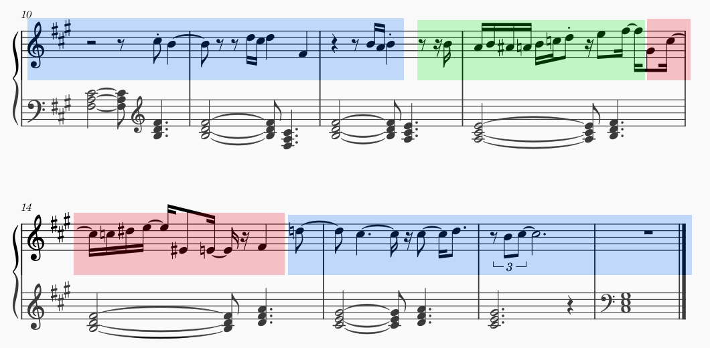

# ParkerGPT: AI-Powered Melody Jazzifier

ParkerGPT processes (monophonic) MIDI melodies using:

1. A Markov chain model for generating jazz chord progressions based on the input melody
2. A bidirectional neural network model that inserts licks, turns, and other jazz goodies into the melody at controlled intervals

The system outputs a MIDI file containing both the jazzified melody and accompanying jazz chord progressions.

By default, the model is trained on Charlie Parker's omnibook, stored in musicxml form

## Table of Contents
- [Requirements](#requirements)
- [Installation](#installation)
- [Usage](#usage)
  - [Training Mode](#training-mode)
  - [Inference Mode](#inference-mode)
- [Examples](#examples)
- [How It Works](#how-it-works)
  - [Chord Generation](#chord-generation)
  - [Melodic Jazzification](#melodic-jazzification)
- [Model Architecture](#model-architecture)

## Requirements
- Python 3.7+
- PyTorch
- music21
- Additional dependencies listed in requirements.txt

## Installation

To install the dependencies, run the following:
```bash
pip install -r requirements.txt
```
To ensure that the program runs and see a summary of the arguments, run:
```bash
python comp2.py --help
```

## Usage

ParkerGPT operates in two modes: training mode and inference mode.

### Training Mode

Training mode is used to train the neural network models on a corpus of music data:

```bash
python comp2.py --train_model --train_data_dir [DIR] --model_save_dir [DIR]
```
Some notes about training:

- The preprocessing step will store a `data.pkl` file containing the preprocessed corpus in your current working directory. This is useful for tuning the model, as preprocessing takes a good amount of time.
- Training mode will generate *two* models (one forward and one backward) and save them both to `model_save_dir`. This is necessary because the jazzified segments are generated in both a forward and a backward direction simultaneously (more on this in [how it works](#melodic-jazzification))
- You may also specify custom training hyperparameters with the argument `--model_config /path/to/config.yaml`. The default hyperparameters are listed in `default_config.yaml`

### Inference Mode

Inference mode splices an input melody with jazzy improvisations generated by the trained model:

```bash
python comp2.py --input_path input_melody.mid --output_path output_jazz.mid
```

You may also include the following flags for further refinement of the jazzification process:

- `--chord_gen_depth D`, where `D` is an integer. This determines the number of Markov generation cycles to run during the chord generation step. The default is 5 cycles.
- `--context_size S`, where `S` is an integer. This determines the size of the context window that the program will use to make inferences about the current melody segment. The context size is measured in quarter notes. The default size is 3.

## Examples

In the `example_inputs` directory, I've provided some input .mid files that should produce interesting results when run through ParkerGPT. For whatever reason, most of my example melodies are from 80's pop songs. I can't remember why I decided to do this. In theory, the model accepts music from other decades as well.

Note: I've found that listening to the direct output midi files on their own can be a bit bland, though when you add a backbeat, the little rhythmic and syncopation choices that the model makes sound a lot better. I've compiled some example outputs and uploaded them [here](https://drive.google.com/drive/folders/1OKUX10wwXncgTr1WkMMdCYzAK4bcaMB8?usp=sharing)

## How It Works

### Chord Generation
The chord generation process builds and uses a *state-based* Markov table to make substitutions for each chord. The process is as follows:

1. First, simple triads are derived from the melody.
2. Next, the Markov table is instantiated. This table maps *states* (groups of 2 chords) to the next chord in a sequence. Since this table has a mapping for every possible 2-chord state, it's domain is quite large. So the table isn't stored, rather generated using the `generate_markov_table` function.
3. Finally, the substitution process is run, starting with the simple triads, as many times as specified by the `--chord_gen_depth` argument.

### Melodic Jazzification:
The melodic jazzification and splicing process is a bit complicated, so here's some annotated sheet music with the first 4 bars of a jazzified version of "Final Countdown" by Europe:



All of the interesting generation stuff happens in the `splice_melody` function. This function scrolls across the input melody, inserting "improvised" segments using the following logic:

1. The bookending **blue** segments are from the original melody. These notes are passed to the models as context.
2. The **forward** model is inferenced using the **past** context to produce the **green** segment. 
3. The **backward** model is inferenced using **future** context to produce the **red** segment. In this case, generation starts from the *end* of the red segment and progresses towards where the red and green segments meet.
4. The resulting effect is a bit of the melody, which leads into a bit of improvisation, followed by some more improvisation which leads right back into the melody.

**Output**: Finally, the system combines the generated melody with the jazzified chord accompaniment into a single MIDI file.


## Model Architecture

The transformer model I built were heavily influenced by Andrej Karpathy's [Let's Build GPT](https://www.youtube.com/watch?v=kCc8FmEb1nY) video, which I've watched many times prior to building this. His architecture is in turn based off of the seminal "[Attention is All you Need](https://proceedings.neurips.cc/paper/2017/hash/3f5ee243547dee91fbd053c1c4a845aa-Abstract.html)" paper which arguably kickstarted the rise of LLMs back in 2017.

My model has 3 transfomer blocks, each with 4 heads of self-attention, interspersed with feedforward layers. It also contains residual connections which 'bypass' certain layers, along with layer normalization for training stability and faster convergence.

The tokenizer I built maps any note or rest to a discrete integer. Each possible token denotes a pitch number (or a rest), and a duration. The input data is quantized into a grid of 24th's of a quarter note, and the longest-duration tokens are 1 beat long. As such, with 128 possible midi pitches and 24 possible durations, the domain of the token embedding space has size $128 \times 24 = 3072$.

The data with which I trained the default model can be found in the `/data` directory, and is comprised of Charlie Parker's complete omnibook, which is [available online](https://homepages.loria.fr/evincent/omnibook/). I chose Parker because I felt that his rhythmic and harmonic choices, especially in improvisation, are perfectly balanced between predictable and innovative, two attributes that LLM-style models are fairly adept at replicating. Parker's improvised lines can be very long and intricate, though they feature minimal repetition, which I think helped prevent overfitting during training. The results, IMO, turned out pretty good.

##

*Created by Jupiter Westbard*
